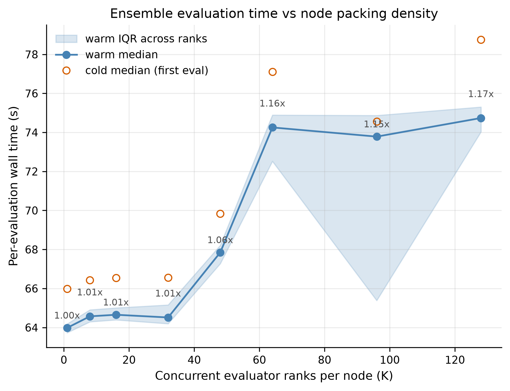
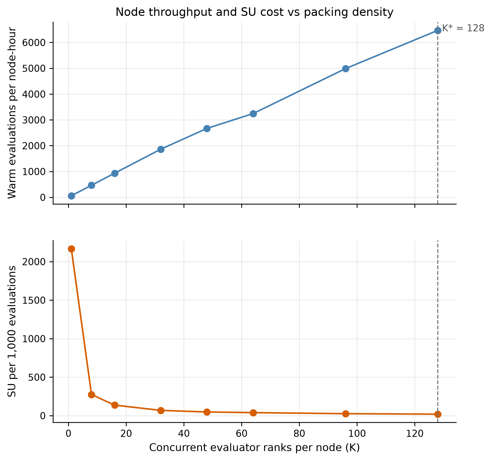
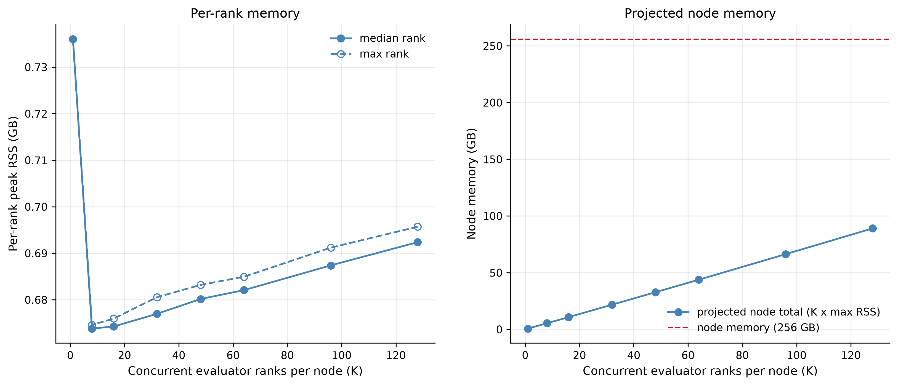
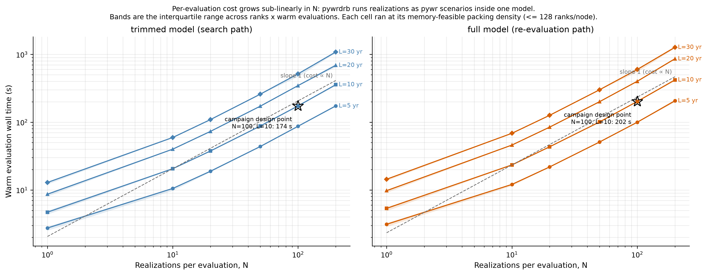
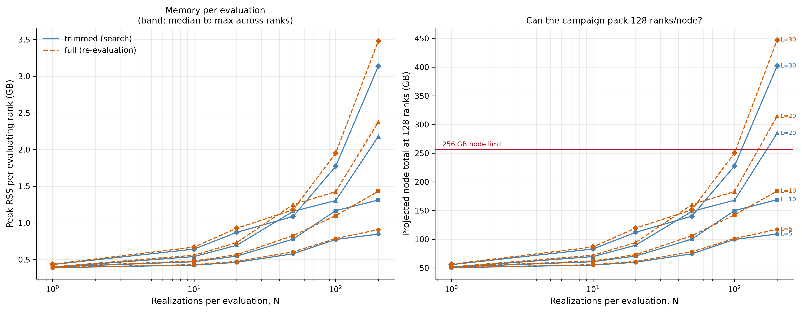
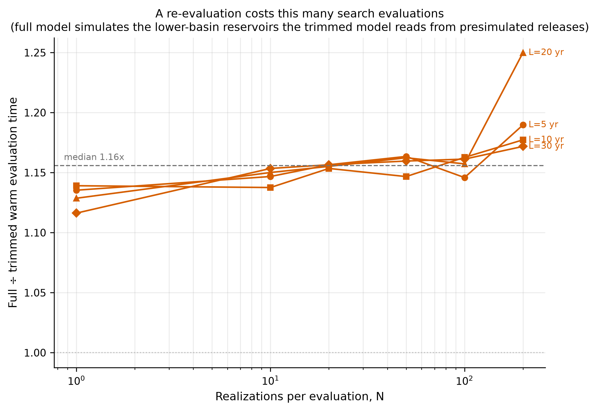
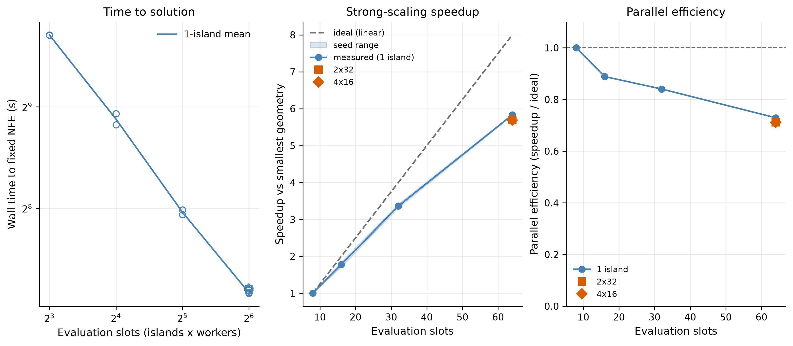

# Supporting Information S1 for "Hazard-Space Scenario Selection for Robust Many-Objective Reservoir Policy Search in the Delaware River Basin"

Trevor J. Amestoy¹

¹ Reed Research Group, School of Civil and Environmental Engineering, Cornell University, Ithaca, NY, USA

*Draft status (2026-08-05). Texts S2 through S6 and S8 carry drafted content from completed preparatory experiments. The remaining texts are outlined because their content depends on experiments that have not yet run. All embedded figures are working versions from pilot-scale or preparatory diagnostics. The selection diagnostics (Text S4) will be regenerated on the production candidate ensembles, and every figure is replaced by its production counterpart before submission. Text numbering follows the order of first reference from the main text.*

---

## Contents

**Text S1.** Trimmed-model verification (outlined). **Text S2.** Synthetic streamflow generation, seed architecture, and determinism (partially drafted). **Text S3.** Hazard metrics, screening, and the selection axes (drafted). **Text S4.** Search-ensemble build diagnostics (drafted at pilot scale). **Text S5.** Objective formulation support (drafted). **Text S6.** Forcing-space parameterization for the re-evaluation ensemble (drafted). **Text S7.** MOEA runtime diagnostics (outlined). **Text S8.** Computational scaling and cost on Anvil (drafted). **Text S9.** Reference-set analyses (outlined). **Text S10.** Supplemental comparison analyses (outlined). **Text S11.** Scenario-design survey table (outlined).

Figures S1 through S24. Tables to be added with the production diagnostics.

---

## Text S1. Trimmed-Model Verification

[Outlined; check complete.] This text will demonstrate that the trimmed Pywr-DRB configuration used during search and re-evaluation (main-text Section 2.3), in which the releases of the non-NYC reservoirs are pre-simulated under default rules and supplied as boundary inflows, reproduces full-model objective values under matched inputs and decision variables. The check evaluates the default FFMP baseline and a small set of reference policies both ways on the historical trace and reports objective-by-objective agreement: across all policy $\times$ objective pairs, trimmed and full values agree to a worst relative deviation of $2.5 \times 10^{-13}$. The structural condition under which the approximation holds is that the boundary releases are policy-independent, so they are computed once per realization and reused for every policy; because this condition is a property of the model configuration rather than of the forcing, the historic-trace validation suffices and no per-ensemble re-check is performed. A separate reproducibility check under the production configuration found objective values deterministic across repeated fresh-process evaluations to a worst relative deviation of $2 \times 10^{-13}$.

## Text S2. Synthetic Streamflow Generation, Seed Architecture, and Determinism

[Partially drafted.] This text will describe the Kirsch-Nowak generation pipeline as implemented, comprising monthly Cholesky-based generation preserving cross-site and lag correlations, nearest-neighbour daily disaggregation, and the downstream-gauge fill, together with the statistical validation of generated flows against the observed record (monthly moments, lag-1 and cross-site correlation, and flow-duration curves; figures to be produced).

**Seed architecture and determinism.** This text documents the deterministic seed architecture that the study's controls rely on. Namespaced, hash-derived seed domains keep the candidate ensemble, the Monte Carlo ensembles, the selection anchor samples, and the re-evaluation ensemble on provably disjoint random streams. Global realization indexing makes generation invariant to how work is partitioned across processes, verified by bit-identical serial-versus-sharded comparison, and any single realization is regenerable exactly from its stored seed and index alone. Two consequences carry methodological weight. First, a candidate ensemble of $10^6$ members is stored as its hazard coordinates and seeds only, with selected members regenerated on demand (main-text Section 3.1.2). Second, a prefix of a generated candidate ensemble is itself an exact i.i.d. sample of the smaller size, so the nested sizing diagnostic of Text S4 is internally consistent.

**Interannual persistence.** The generator reproduces monthly and cross-site structure but, like the annual bootstrap it descends from, carries essentially no interannual memory. Water-year lag-1 autocorrelation is approximately 0.10 in generated flows against 0.26 in the fitted record. The record's own persistence is epochal (lag-1 of 0.51 before 1980 and 0.06 after, within an approximately 43-year pluvial), and the CMIP6 ensemble's apparent persistence changes are statistically indistinguishable from 39-year sampling variability. Persistence is therefore stressed in neither the search population nor the re-evaluation ensemble, and every claim is scoped accordingly (main-text Section 3.4.1). Figure S1 summarizes the characterization.

**Figure S1.** Interannual persistence characterization. Water-year lag-1 autocorrelation in the fitted record and in generated flows, the epochal structure of the record's persistence, and the CMIP6 ensemble's persistence changes relative to 39-year sampling variability.

## Text S3. Hazard Metrics, Screening, and the Selection Axes

**Metric definitions.** All hazard coordinates are computed on the aggregate inflow to the three NYC reservoirs, with the same six-month metric exclusion applied by date as in the objectives (main-text Section 3.1.3, where the six selection-axis metrics are given as Equations 1 through 5). Beyond the six selection axes, two further metrics are computed for every realization, drought event duration and flood rise rate, and their definitions and exclusion from the selection distance are documented here. The five drought metrics derive from run theory on the six-month Standardized Streamflow Index (SSI-6), with the gamma SSI fit made once on the observed record per calendar month. An event is a run of SSI-6 below zero that reaches minus one or lower, terminated by three consecutive non-negative months, and the controlling event, the one with the largest cumulative deficit, is scored. Drought magnitude is the absolute accumulated SSI over the run, duration its length in months, severity the absolute minimum SSI, onset rate the severity divided by months from onset to peak, and recovery rate the severity divided by the recovery period. All five are zero for a realization with no qualifying event (0.7 percent of candidate realizations). The three flood metrics derive from a peaks-over-threshold analysis of daily flows at the 95th percentile of the observed record, scoring the critical pulse, the exceedance run containing the realization's maximum daily flow, so exactly one pulse is scored per realization with no declustering parameter. Peak discharge is the realization maximum normalized by the observed mean daily flow, pulse duration the days above threshold within the run, and rise rate the largest one-day rise on the rising limb, likewise normalized. The threshold and normalizing mean are fixed once on the observed record, so coordinates are comparable across the candidate ensemble, the realized search ensembles, and the re-evaluation ensemble.

**The redundancy screen.** Before selection, the metrics are screened on the candidate ensemble's hazard coordinates. Degenerate metrics (near-zero spread) are dropped, and near-duplicate groups at absolute Spearman rank correlation of at least 0.95 are pruned to one canonical member. On this population the screen retains all eight metrics. The largest pairwise rank correlation is 0.88, between drought magnitude and duration, and the next largest between-concept correlations are 0.61 (drought magnitude and severity) and 0.60 (peak discharge and rise rate). The retained set is unchanged if the pruning threshold is tightened to 0.90 and is stable across candidate-ensemble sizes from $2 \times 10^3$ to $10^6$ members. The full rank-correlation structure, characterized following Olden and Poff (2003), is shown in Figure S2.

**Figure S2.** The redundancy screen and rank-correlation structure of the eight hazard metrics on the candidate ensemble's hazard coordinates.

**The selection axes.** Six of the eight metrics enter the selection distance (main-text Section 3.1.3): magnitude, severity, onset rate, and recovery rate on the drought side, and peak discharge and pulse duration on the flood side. Drought duration and flood rise rate are excluded from the distance, duration as the most redundant retained pair member (rank correlation 0.88 with drought magnitude, with a quasi-discrete, months-valued tail) and rise rate as the flood metric most correlated with the retained flood pair (rank correlation 0.60 with peak discharge), and both remain computed for every candidate realization and reported post-hoc.

**Selection invariance.** A leave-one-axis-out analysis shows no single axis dominates the selection. Removing any one axis changes the selected set by a comparable amount (Jaccard similarity 0.18 to 0.27 against the full-set selection), and the per-axis shares of squared assignment displacement are near-uniform (0.08 to 0.16 against 0.125 under exact uniformity). The drought and flood concept groups carry weight in proportion to their axis counts, so the selection distance encodes no hidden re-weighting beyond the disclosed axis composition (Figure S3).

**Downstream-stress correlation.** [Planned; required build diagnostic.] Because the hazard coordinates are defined on aggregate NYC inflow while the Montague, Trenton, and flood-stage objectives are decided at downstream sites that include unregulated tributary contributions, this analysis will correlate the selected ensembles' hazard coordinates against realized stress at the downstream objective sites, verifying that drought-axis and flood-axis enrichment translates into realized stress where the objectives are computed. This diagnostic is computed as part of the quality control for every production draw.

**Event seasonality.** [Planned.] No descriptor encodes event timing, although a drought peaking against the spring refill differs operationally from one peaking in the fall void under the FFMP's seasonally indexed rule structure. This analysis will report descriptively whether the selected ensembles span event seasonality even though timing is not a selection axis.

**Figure S3.** Selection-invariance diagnostics. Leave-one-axis-out overlap with the full-set selection and per-axis shares of squared assignment displacement.

## Text S4. Search-Ensemble Build Diagnostics

This text verifies that the hazard-filling selection achieves the intended distribution shift, which is a precondition for interpreting the main comparison. Coverage statistics are reported as method verification only, and the design comparison is made exclusively on re-evaluated robustness (main-text Section 3.4). The results below are from the diagnostic battery at pilot scale, run on a 2,000-member candidate ensemble at $N = 100$ with ten anchor seeds and a 50-seed random null. The production battery runs at the campaign ensemble size of $N = 300$ on each production candidate ensemble, and each production draw's realized coverage, bounds, and clipped fractions are persisted as build quality control.

**Realized coverage.** In the pilot geometry the selection attains an L2-star discrepancy of 0.023 against 0.132 for a random subset of the same size, places on average 26 percent of selected members above the candidate ensemble's 90th percentile on each axis against the 10 percent that i.i.d. sampling delivers, and selects at least one member in the severe corner of 95 percent of axes against 51 percent for random selection. Every axis is individually better stratified than the null. The selection also avoids the candidate ensemble's zero-event atom (realizations with no qualifying drought event), whereas a maximin selection rule over-samples that corner. Figures S4 through S6 show the selection geometry, the coverage comparison against the random null, and the tail-enrichment and zero-event-atom behavior.

**Figure S4.** Selected members in the scaled hazard space, with Latin hypercube anchors and their assigned candidate members across pairs of selection axes.

**Figure S5.** Realized coverage of the hazard-filling selection against a random subset of the same size, including L2-star discrepancy and per-axis stratification.

**Figure S6.** Per-axis tail enrichment above the candidate ensemble's 90th percentile and treatment of the zero-event atom, for the hazard-filling selection and the random null.

**Selection-rule simplicity checks.** An optimal one-to-one assignment of anchors to members (Hungarian algorithm) is indistinguishable from the sequential nearest-neighbor assignment on every coverage metric, so the sequential rule's order dependence is immaterial and the simpler rule is retained. Selections built on disjoint halves of the candidate ensemble achieve identical tail enrichment, evidence that the construction is stable under replication of its inputs. Figure S7 reports the assignment-distance and member-separation distributions.

**Figure S7.** Anchor-to-member assignment distances and pairwise separation of selected members, for the sequential nearest-neighbor rule and the optimal-assignment variant.

**Robust bounds.** Sweeping the normalization bounds confirms the robust p1/p99 choice (main-text Section 3.1.3). Full-range scaling degrades realized coverage roughly threefold, the outlier-fixation failure mode, while coverage and enrichment vary smoothly across nearby robust-percentile settings, with no sensitivity cliff at the default (Figure S8).

**Figure S8.** Coverage and enrichment across normalization-bound settings, from full-range scaling to interior robust-percentile bounds.

**Dimension and candidate-ensemble size.** Mean anchor-to-member assignment distance roughly triples between four-axis and eight-axis selection on the same candidate ensemble, with per-axis tail enrichment falling accordingly, the finite-sample dilution that motivates restricting the selection space to six axes (Figures S9 and S10). The nested sizing diagnostic repeats the selection on nested prefixes of a single $10^6$-member candidate ensemble, which are exact i.i.d. samples of every intermediate size (Text S2). On the six selection axes at $P = 10^6$, the share of selected members above the candidate ensemble's 90th percentile ranges from 28 to 51 percent across axes, and its minimum over axes is 0.27 to 0.29 on each of the production draws staged at $N = 100$, with drought magnitude the binding axis. Enlarging $N$ at fixed candidate-ensemble size lowers this enrichment only when the candidate ensemble is small relative to $N$ (prefixes of at most $2 \times 10^4$ members); at $P = 10^6$ the enrichment is flat from $N = 50$ to $N = 500$ while the joint coverage of the selection keeps improving, so candidate-ensemble size does not bound $N$ from above at the production scale and the ensemble size is instead set by the estimator-precision analysis of Text S5 (main-text Section 3.1.1; Figure S11).

**Figure S9.** Per-axis marginal coverage of the selection across the six selection axes.

**Figure S10.** Assignment distance as a function of the number of selection axes at fixed candidate-ensemble size.

**Figure S11.** Per-axis tail enrichment as a function of ensemble size $N$ at fixed candidate-ensemble size.

**Compositional divergence.** For each production draw this text will report the exceedance frequencies of drought severity, duration, and flood magnitude above high candidate-ensemble quantiles in the realized HF and MC ensembles, the direct measurement of how far the selection shifts the search distribution toward the severe corners relative to i.i.d. sampling.

## Text S5. Objective Formulation Support

**Epsilon calibration.** The epsilon-dominance precisions of main-text Table 3 were calibrated on the search ensembles themselves, in two stages. First, per-objective floors were measured. For each matched design, 512 random decision vectors drawn uniformly on the constraint-feasible region, plus the default FFMP baseline, were evaluated on that design's own first-draw search ensemble, which at the time of calibration was that draw's $N = 100$ ensemble, and each objective's floor is the largest of one tenth of the signal interquartile range, a bootstrap noise floor on the annual-unit estimator, and the estimator's frequency granularity, taken over the two matched designs and rounded up to a clean value, following the significant-precision guidance of epsilon-dominance applications (Reed et al., 2013; Kasprzyk et al., 2013). The raw requirement differs by at most a factor of 2.5 between the two designs, so a shared vector sacrifices little. The floors are re-measured on the campaign ensembles at $N = 300$ before the searches, and the adopted vector stays in force provided every entry lies above its re-measured floor. Second, because ensemble-averaged objectives are far smoother than single-trace objectives, floor-level precisions over-resolve converged ensemble fronts; the adopted vector therefore coarsens the floors to one shared precision per objective family (reliabilities 0.05, deficit severities 10.0, flood 0.3, storage 5.0), selected by an archive-cardinality diagnostic that re-filters converged search archives under candidate vectors so that the merged Pareto-approximate sets stay within the re-evaluation sizing of 1,000 to 1,200 policies in force at calibration (the campaign caps re-evaluation at 2,000 merged policies, Text S8) while every trade-off axis retains its span. The cardinality diagnostic is repeated on the first archives searched at $N = 300$. The static re-filter counts are lower bounds on live-search archive sizes, because the epsilon archive steers selection and restarts during a run; the measured live-search inflation is roughly 10 to 35 percent. The Historical reference is measured but excluded from the calibration maximum. Its single trace supplies only 77 annual units, and its noise floors would coarsen the shared reliability precisions well beyond what the ensemble designs need; it searches at the shared precisions instead, with its archive resolving below its own sampling noise on the reliability objectives.

**Formulation convention screens.** The formulation's conventions were fixed by post-hoc reductions of the epsilon-calibration policy populations (512 constraint-feasible policies plus the default-FFMP baseline per matched design) rather than asserted. The annual failure-week counts $k$ were screened for saturation over $k \in \{1, \ldots, 4\}$ in both ensemble compositions. No adopted value saturates (worst case 0.4 percent of the population at the band edges), rankings are stable to $k \pm 1$ ($\tau_b \ge 0.94$ for NYC delivery, Montague, and NJ), and Trenton's $k = 1$ is binding: at $k = 3$ between 24 and 44 percent of policies tie at reliability of at least 0.95, and at $k = 4$ about 97 percent. The flood unit operator was fixed to the mean. At the 900 pooled annual units of the $N = 100$ calibration ensembles the 99th-percentile variant collapses onto a few discrete values (population interquartile range near zero in the hazard-filling composition), carries a bootstrap noise 12 to 30 times that of the mean, and induces an unstable ranking (bootstrap $\tau_b$ of 0.35 to 0.60 against 0.92 to 0.93 for the mean). The same policy populations bound the flood objective's controllability. The policy-invariant empirical floor accounts for 57 to 61 percent of the baseline's flood exposure, so at least 39 to 43 percent is controllable by the decision space. The eighth objective, NJ delivery reliability, was activated by the redundancy screen (Spearman $|\rho| \le 0.38$ against every objective and $\le 0.08$ against Trenton flow reliability), with its precision already calibrated so that activation required no recalibration.

**The flood-exceedance metric.** The flood objective's magnitude-weighted exceedance form (main-text Section 3.2.2) was selected by a dedicated diagnostic on the same policy populations. The day-count form is degenerate across policies, taking few distinct integer values that move in shelves along the flood-release ladder, whereas the stage-exceedance form resolves the full policy population, is strictly monotone in realized flood exposure across the ensemble (Spearman $\rho = -1.00$ with the release ladder), and tracks observed annual flood magnitude. Day-count variants at the NWS minor and major stages and the FFMP action stage remain reported diagnostics.

**Estimator stability of the annual-unit aggregation and the ensemble size.** The campaign ensemble size of $N = 300$ is derived from a direct measurement of estimator precision across ensemble sizes rather than argued from unit counts, with a per-realization annual-unit library: ten policies fixed by rule before any result (the default FFMP, the per-objective best solutions of the pilot Pareto sets for NYC delivery reliability, Montague flow reliability, flood exceedance, and storage, the best-satisficing compromise of each matched design, their nearest neighbors in objective space, and the closest-to-ideal compromise) were simulated once on every one of 8,971 candidate-ensemble members (the first 5,000 rows of the production candidate ensemble, an exact i.i.d. sample, plus every member the hazard-filling selector chooses at $N$ between 50 and 500 under three anchor plans) and on the six production draws staged at $N = 100$, and the objective vector of any ensemble was then composed offline by pooling its members' annual units through the operators of Equation 10. The unit of independence throughout is the realization, never the annual unit. For the i.i.d. design the reference was partitioned into $\lfloor 5000/N \rfloor$ disjoint size-$N$ replicates (100 at $N = 50$, 50 at $N = 100$, 10 at $N = 500$); for the hazard-filling design the replicates are independent constructions (three anchor plans on one candidate ensemble, plus the two further production draws on fresh candidate ensembles at $N = 100$). The pre-registered criteria, each in units of the objective's epsilon-dominance precision, were: level standard error at most $\varepsilon$; standard error of the paired difference between two policies on common realizations at most $\varepsilon/2$ for every pair (the binding criterion, because paired differences on common samples are what the archive decides on; Linderoth et al., 2006; Kasprzyk et al., 2013); epsilon-dominance flip rate against the full reference at most 0.05; and estimator bias at most $\varepsilon/2$ (Kaut and Wallace, 2007).

Three results carry the sizing argument. First, every reliability objective and the flood objective meet every criterion from $N = 75$ in both designs: at $N = 100$ their worst-pair paired standard errors are at most $0.34\varepsilon$ and their bias is nil (frequency and mean operators are unbiased). Second, the decision is carried entirely by the three pooled-percentile operators. For the i.i.d. design their worst-pair paired standard error is $0.7$–$0.8\varepsilon$ at $N = 100$ (NYC deficit, Montague deficit, storage), decays as $N^{-1/2}$, and first reaches $\varepsilon/2$ at $N = 300$ ($0.40$–$0.45\varepsilon$); the pair-median paired standard error is $0.1$–$0.4\varepsilon$ at $N = 100$, and the binding pairs are those involving the per-objective-best extremes. The worst-first-percentile NYC deficit operator takes values on discrete shelves fixed by the FFMP drought-stage delivery cuts, so a replicate that moves the worst unit onto the next shelf moves the objective by one to three $\varepsilon$ at once; the hazard-filling design, which selects exactly the members that decide the shelf, shows a between-construction standard deviation of $2$–$4\varepsilon$ on that objective at every $N$ up to 400 and $0.7\varepsilon$ at $N = 500$, so no ensemble size on the ladder makes a hazard-filling construction reproducible to $\varepsilon/2$ on that axis; its Montague deficit and storage operators reproduce from $N = 200$–$400$. Third, the realization-level block bootstrap against a naive unit-level bootstrap gives effective sample sizes of $0.68$ to $1.0$ times the pooled unit count for the i.i.d. design (lowest for NYC deficit and NYC reliability, unity for the flood mean) and $0.7$ to $1.2$ for hazard filling: serial dependence within a realization costs at most about 30 percent, so the 2,700 pooled annual units of one evaluation at $N = 300$ act as roughly 1,840 to 2,700 independent units, exceeding the 1,000 one-year realizations of Quinn et al. (2017, 2018), and every standard error reported here is realization-level. Hazard-filling selections in hazard space were checked over the same ladder: on the $10^6$-member candidate ensembles the selector's tail enrichment is flat in $N$ (Text S4), so the ensemble size is a question of estimator precision and cost alone. On statistical grounds the i.i.d. design requires $N = 300$ to resolve every objective at the archive's precision. The worst-pair paired standard error of the three percentile operators decays as $N^{-0.41}$ to $N^{-0.48}$, crossing $\varepsilon/2$ between $N = 210$ and $283$ by fit, and $N = 300$ is the first size on the measured ladder past that crossing. For the hazard-filling design the ladder to $N = 500$ with three constructions per size does not locate the crossing on the NYC deficit axis. The fitted decay there is $N^{-0.24 \pm 0.25}$, indistinguishable from a plateau, and a standard deviation estimated from three constructions carries a relative error of about 50 percent. The common ensemble size is therefore set at $N = 300$, the value the i.i.d. design requires, and the hazard-filling design's residual on the NYC deficit axis is carried as a measured property of that construction rather than resolved by a larger $N$. At $N = 300$ the residual is quantified. For the i.i.d. design the worst-pair paired standard error of the three percentile operators is $0.40$–$0.45\varepsilon$, and for the hazard-filling design the NYC deficit operator remains reproducible across constructions only to within a few epsilon, as measured on the ladder.

**Remaining items.** The satisficing criterion anchors and their threshold-margin diagnostics, consisting of each objective's cumulative distribution across the re-evaluation ensemble with the criterion overlaid (following Gold et al., 2023), accompany the criterion sweep of main-text Section 3.4.2. The 0.99 weekly satisfaction factor is bounded by a dedicated factor sweep on the same policy population.

## Text S6. Forcing-Space Parameterization for the Re-Evaluation Ensemble

The deeply uncertain climate forcing enters this study only in the held-out re-evaluation ensemble (main-text Section 3.4.1), so this text documents the forcing parameterization as the basis of that ensemble rather than of any search ensemble.

**Harmonic parameterization.** Each of 54 CMIP6 future-run change profiles, the ratio of future to historical monthly mean flow computed per model run, is fit with a second-order harmonic in the log change factor. The three sampled coordinates are the annual-mean level and the two harmonic amplitude ratios, which govern annual volume, seasonal amplitude, and the snowmelt-shoulder shape; the median per-profile shape $R^2$ is 0.85. The harmonic phases are held fixed at the fit to the CMIP6 ensemble-mean profile, because individual-run phases, especially the semiannual phase, are noisy, and sampling them would add dimensions that encode fit noise rather than climate information. The re-evaluation ensemble samples the three amplitudes by Latin hypercube over their full empirical range across the 54 runs, widened by a 25 percent margin. Figures S12 through S16 show the harmonic fit quality, the fitted parameter space, and the sampled envelope.

**Figure S12.** Second-order harmonic fit to the CMIP6 ensemble-mean monthly change profile.

**Figure S13.** Best and worst individual-run harmonic fits across the 54 CMIP6 change profiles.

**Figure S14.** The fitted harmonic parameter space of the 54 CMIP6 change profiles.

**Figure S15.** The Latin hypercube sampling envelope over the fitted amplitudes, widened by the 25 percent margin, relative to the CMIP6-fitted points.

**Figure S16.** Monthly-flow envelopes implied by the sampled forcing space, compared with the CMIP6 change profiles.

**Injection.** The forcing is applied to the fitted monthly moments of the stochastic generator through the lognormal moment-matching transform of Kirsch et al. (2013). The convention preserves each month's coefficient of variation, so a mean reduction carries a proportional reduction in absolute variability and relative drought and flood behavior is not distorted by the moment arithmetic itself.

**The variance axis, evaluated and excluded.** An independent coefficient-of-variation axis, derived from each CMIP6 run's own historical-to-future variance ratio, was implemented and evaluated with a paired hazard-footprint diagnostic using matched realizations generated with and without the axis across the forcing box. Adding the axis left the drought hazard footprint essentially unchanged (span ratios 0.88 to 1.20 across the drought axes) and contracted all three flood-axis spans (0.72 to 0.83), because the CMIP6 envelope reduces relative variability in the winter and spring flood season. Three additional dimensions would therefore dilute the Latin hypercube stratification of the forcing space without adding stress coverage, and the axis is excluded from the re-evaluation ensemble (Figure S17).

**Figure S17.** Paired hazard-footprint diagnostic for the coefficient-of-variation axis, comparing drought-axis and flood-axis spans with and without the axis across the forcing box.

## Text S7. MOEA Runtime Diagnostics

[Outlined; being finalized.] This text will report the runtime dynamics of the MM Borg searches for each design and seed, comprising archive snapshots, operator probabilities, restart behavior, and hypervolume against reference sets constructed per design, following the diagnostic conventions of Reed et al. (2013). These diagnostics are read as within-design convergence evidence only and are never compared across designs (main-text Section 3.3). The first seed of every design is continued to 750,000 NFE while its reported result is the runtime-archive snapshot at 500,000 NFE, and the runtime hypervolume over the continuation beyond that snapshot is the evidence that the 500,000-NFE budget is sufficient rather than merely conventional.

## Text S8. Computational Scaling and Cost on Anvil

### S8.1 Overview

The experimental design requires independent multi-master Borg (MM Borg) searches, one for each combination of design and seed, each evaluating a trimmed Pywr-DRB ensemble simulation at every function evaluation, followed by a trimmed-model re-evaluation phase on the re-evaluation ensemble (the full model is used only for the one-time presimulation passes and the historical baseline). Sizing the experiments against the available compute required three measurements on the Purdue Anvil system, whose nodes carry 128 AMD EPYC cores: how densely independent concurrent evaluations can be packed onto a node, how per-evaluation cost scales with the ensemble shape, and the strong-scaling behavior of the MM Borg driver. The measurements include a direct sweep of the per-evaluation cost surface across ensemble size, record length, and model variant, so the computational cost is priced from measurement rather than extrapolation.

### S8.2 Node-packing density

A node-packing sweep placed $k$ concurrent, fully independent evaluation processes on one node, for $k$ from 1 to 128, each repeatedly executing an ensemble evaluation with threading pinned to one thread per core. Per-evaluation wall time is nearly constant through half-node packing and rises by at most 17 percent at full packing, while node throughput rises almost linearly with packing density, so the cost per evaluation falls by two orders of magnitude from single-core to full-node operation (Figures S18 and S19). The densest packing of 128 concurrent evaluations per node is therefore the production choice, subject to node memory. At 100 realizations of 10 years the resident set is approximately 1.2 GB per evaluation process and a measured 139 to 140 GB per node at full packing (Figure S20). At the campaign size of 300 realizations of 10 years, a conservative linear envelope in simulated years that reproduces the measured node resident set at 100 realizations projects about 259 GB per node at full packing, above the node's safe capacity of about 217 GB of its 256 GB. Production evaluations therefore simulate the ensemble in two sequential batches of 150 realizations, which holds the resident set near the measured 100-realization level (a projected 167 GB per node) at a time penalty bounded at 9 percent, as measured at $N = 20$.

**Figure S18.** Per-evaluation wall time as a function of node-packing density.

**Figure S19.** Node throughput and cost per evaluation as functions of node-packing density.

**Figure S20.** Per-process resident memory across the node-packing sweep.

### S8.3 The ensemble cost surface

Per-evaluation wall time was measured at 128 concurrent evaluations per node across a grid of ensemble sizes ($N$ from 1 to 200) and record lengths ($L$ from 5 to 30 years), for both the trimmed and the full model (Figures S21 through S23). Three results size the experiments.

First, the evaluation is inexpensive. At the anchor cell of the cost surface, $N = 100$ realizations of $L = 10$ years, one trimmed-model function evaluation takes a warm median of 173.8 s, corresponding to 48.3 service units (SU) per 1,000 evaluations at full node packing. The campaign ensemble of $N = 300$ lies beyond the measured grid, and its cost is scaled from this anchor cell by the fitted exponent below (S8.5).

Second, cost scales with the total number of simulated years, close to linearly in each factor. Power-law fits give an exponent on $N$ of 0.95 to 0.96 (0.951 for the trimmed model at $L = 10$, fitted on $N$ from 10 to 200 with $r^2$ of 0.999) and an exponent on $L$ near 1.0 across the surface, so per-evaluation cost is slightly sub-linear in the number of realizations at fixed record length. The cost at any ensemble shape therefore cannot be obtained by scaling a smaller ensemble linearly, which is why the surface was measured rather than extrapolated.

Third, the full model is only modestly more expensive than the trimmed model. Across the surface the full-to-trimmed time ratio is approximately 1.16, and at the anchor cell the full-model evaluation takes 202.1 s against the trimmed model's 173.8 s. The full model appears in the experiments only in the one-time presimulation of the policy-independent boundary releases (once per staged realization, including the re-evaluation ensemble's) and in the historical baseline, so this ratio prices those passes; re-evaluation itself runs the trimmed model at the measured trimmed rate.

**Figure S21.** The per-evaluation cost surface across ensemble size $N$ and record length $L$ for the trimmed model.

**Figure S22.** Per-process memory across the ensemble cost surface.

**Figure S23.** The full-to-trimmed model evaluation-time ratio across the cost surface.

### S8.4 MM Borg strong scaling

A strong-scaling experiment ran the MM Borg driver to a fixed function-evaluation budget while growing the evaluator pool, across single-island configurations from 8 to 64 evaluator cores and two multi-island configurations at 64 cores (Figure S24). Parallel efficiency is 0.73 at 64 cores relative to the 8-core baseline, and at a fixed core count island partitioning is nearly free, so island count is treated as a search-quality choice rather than a throughput choice, consistent with the reliability arguments for multi-master search made by Hadka and Reed (2015) and Zatarain Salazar et al. (2017). The strong-scaling experiment used a lighter evaluation than the production ensemble, so the measured efficiency is conservative for the more compute-heavy production evaluation.

**Figure S24.** MM Borg strong scaling across evaluator-pool sizes and island geometries.

### S8.5 Production cost against the remaining balance

Each production search runs the MM Borg driver on twelve nodes (1,536 cores) as four islands with 382 evaluator cores each, plus one master core per island and one controller core, for 1,533 cores in use at 128 processes per node. Each function evaluation simulates the 300-realization ensemble in two sequential batches of 150 realizations (S8.2). Every matched design is searched on one ensemble draw with two seeds. The first seed runs to 750,000 function evaluations (187,500 per island) and the second to 500,000 (125,000 per island), with runtime-archive snapshots every 2,500 evaluations per island. Every seed is reported at 500,000 evaluations, the first seed through its runtime archive recorded at 125,000 evaluations per island, and the continuation of the first seed to 750,000 serves only as convergence evidence (Text S7). Searches are NFE-bounded with no algorithm-level wall-time cap, because such a cap could truncate NFE unequally across designs and break the equal-budget condition. No search resumes after a scheduler kill, so every search is sized to finish within one 96 h job, and the reported snapshot of the first seed falls at about two thirds of its projected wall time, so the equal-budget result survives a job killed late in its continuation.

The cost basis is measured rather than modeled. The two production searches completed at $N = 100$ and 500,000 NFE on eight nodes each ran for 21.3 h and cost about 21,850 SU. Combining the anchor-cell evaluation time of 173.8 s (S8.3) with the strong-scaling efficiency of 0.73 (S8.4) projects 33,400 SU and 32.6 h for the same search, 1.53 times the measured cost. The projection assumes every function evaluation simulates the full ensemble, whereas decision vectors that violate the release-ordering constraint are rejected before any simulation and return in under 0.1 s, so the mean cost per evaluation lies below the cost of one ensemble simulation. The measured basis is adopted and the modeled basis is carried as a stress case. From the $N = 100$ anchor, cost scales as $(N/100)^{0.951}$ (fitted on $N$ from 10 to 200, $r^2$ of 0.999, S8.3) and linearly in NFE, with the batching penalty bounded at 9 percent as measured at $N = 20$. Node scaling beyond eight nodes is unmeasured, so every twelve-node figure carries a factor between 1.00 and 1.17. On this basis one first-seed search of a matched design (750,000 NFE) is projected at about 102,000 to 118,000 SU and 66 to 77 h, and one second-seed search (500,000 NFE) at about 68,000 to 79,000 SU and 44 to 51 h, for about 340,000 to 394,000 SU over both matched designs and both seeds. The first-seed searches are themselves the measurement of the twelve-node cost, and the second-seed submissions are conditioned on the price they realize.

The HIST reference evaluates a single 78-year trace per function evaluation and costs a measured 4,200 SU per 500,000 NFE, about 6,300 SU for its 750,000-NFE first seed, so its two seeds cost about 10,500 to 12,300 SU. Ensemble generation involves no Pywr-DRB simulation (generating one $10^6$-member candidate ensemble costs approximately 600 core-hours in sharded execution), and the staging of the search ensembles and their additional draws, the epsilon re-calibration at $N = 300$, and the batched-evaluation memory check are carried at a 5,000 SU allowance. Re-evaluation of every final policy on the re-evaluation ensemble runs the trimmed model (main-text Section 3.4.1) on the leading 500 of the 1,000 generated SOWs, with 25 realizations per SOW and 50-year records, at a measured 33 SU per policy, and is capped at 2,000 merged policies, about 66,000 SU. If the merged sets exceed the cap, the post hoc epsilon re-filter is coarsened to the cardinality target and applied identically to every design. The draw-sensitivity re-evaluation of Text S10 adds about 1,000 SU. The total is therefore about 423,000 SU on the measured basis and about 478,000 SU with the node-scaling factor at 1.17, against a remaining balance of about 600,000 SU. On the refuted modeled basis the total would be about 605,000 SU, which the balance does not cover.

## Text S9. Reference-Set Analyses

[Outlined.] This text will report dominance-based summaries over the merged re-evaluated policies with their caveats stated up front, namely self-reference (a design contributes points to the frontier it is scored against), cardinality asymmetry, and noise-induced spurious dominance, together with cardinality diagnostics (main-text Sections 3.3 and 3.4.2).

## Text S10. Supplemental Comparison Analyses

[Outlined.] This text will report analyses that support but do not constitute the primary comparison: the two sensitivities of the adopted robustness unit (main-text Section 3.4.2), namely the within-SOW collapse, where the per-SOW pooling of main-text Equation 15 is replaced by the worst realization in the SOW, and the unit itself, where the criterion is instead applied to the pooled realizations, with the design ranking recomputed under each and any disagreement reported; ranking-stability tables using Kendall's $\tau_b$ across metrics and across criterion-sweep stringencies; the attainability analysis in detail; the ensemble-composition checks, in which hazard-restricted and envelope-restricted subsets of the re-evaluation ensemble are re-scored from the stored re-evaluation output; and, as an optional supporting analysis, scenario discovery in the deeply uncertain factor space of the re-evaluation ensemble after re-evaluation, characterizing which forcing conditions drive each design's failures. The discovery analysis is reported as supporting evidence for any observed robustness difference, not as a primary result; no scenario discovery is performed in hazard space.

This text will also report the draw-sensitivity re-evaluation. Each matched design is searched on one draw of its search ensemble (main-text Section 3.3), and after the searches its final Pareto-approximate set is re-simulated on two independent additional draws of that same design at $N = 300$. The shift in each policy's search-ensemble objective values across draws, in units of the epsilon-dominance precisions, quantifies how far the searched set depends on the one draw it was searched on, without replicating the search itself.

The hazard-restricted re-scoring takes the form of a pre-registered hazard-support decomposition. Each re-evaluation SOW is classified as inside, at the fringe of, or outside the support of the stationary candidate ensemble's hazard image — from the nearest-candidate distance of its 10-year sub-window hazard coordinates in the selector's own robust range-scaled geometry, with the strata cut points, the exceedance quantile, and the decision rules fixed before any production re-evaluation output was inspected — and the HF minus MC contrast in best-attained satisficing and no-harm frequency is re-scored within each stratum, alongside the matching decomposition over terciles of the dominant forcing factor. A difference that persists on out-of-support SOWs states the generalization claim directly; a difference confined to the supported region bounds it. Because the selection axes encode hazard magnitudes only, seasonal-structure forcing is outside the support of both arms alike and the decomposition is read as bounding hazard-magnitude generalization, a stated scope limitation rather than a bias.

## Text S11. Scenario-Design Survey Table

[Outlined.] This text will present the survey of scenario designs used during search in water-resources and MOEA policy-search studies, with the design space, the ensemble sizing, and per-study verification notes, situating the MC and HF constructions within that survey (main-text Section 3.1.1).

---

## References (Supporting Information)

- Gold, D. F., Reed, P. M., Gorelick, D. E., & Characklis, G. W. (2023). Advancing regional water supply management and infrastructure investment pathways that are equitable, robust, adaptive, and cooperatively stable. *Water Resources Research*, 59(9), e2022WR033671.
- Hadka, D., & Reed, P. (2015). Large-scale parallelization of the Borg multiobjective evolutionary algorithm to enhance the management of complex environmental systems. *Environmental Modelling & Software*, 69, 353–369.
- Kasprzyk, J. R., Nataraj, S., Reed, P. M., & Lempert, R. J. (2013). Many objective robust decision making for complex environmental systems undergoing change. *Environmental Modelling & Software*, 42, 55–71.
- Kirsch, B. R., Characklis, G. W., & Zeff, H. B. (2013). Evaluating the impact of alternative hydro-climate scenarios on transfer agreements: Practical improvement for generating synthetic streamflows. *Journal of Water Resources Planning and Management*, 139(4), 396–406.
- Olden, J. D., & Poff, N. L. (2003). Redundancy and the choice of hydrologic indices for characterizing streamflow regimes. *River Research and Applications*, 19(2), 101–121.
- Quinn, J. D., Reed, P. M., Giuliani, M., & Castelletti, A. (2017). Rival framings: A framework for discovering how problem formulation uncertainties shape risk management trade-offs in water resources systems. *Water Resources Research*, 53(8), 7208–7233.
- Quinn, J. D., Reed, P. M., Giuliani, M., Castelletti, A., Oyler, J. W., & Nicholas, R. E. (2018). Exploring how changing monsoonal dynamics and human pressures challenge multireservoir management for flood protection, hydropower production, and agricultural water supply. *Water Resources Research*, 54(7), 4638–4662.
- Reed, P. M., Hadka, D., Herman, J. D., Kasprzyk, J. R., & Kollat, J. B. (2013). Evolutionary multiobjective optimization in water resources: The past, present, and future. *Advances in Water Resources*, 51, 438–456.
- Zatarain Salazar, J., Reed, P. M., Quinn, J. D., Giuliani, M., & Castelletti, A. (2017). Balancing exploration, uncertainty and computational demands in many objective reservoir optimization. *Advances in Water Resources*, 109, 196–210.
